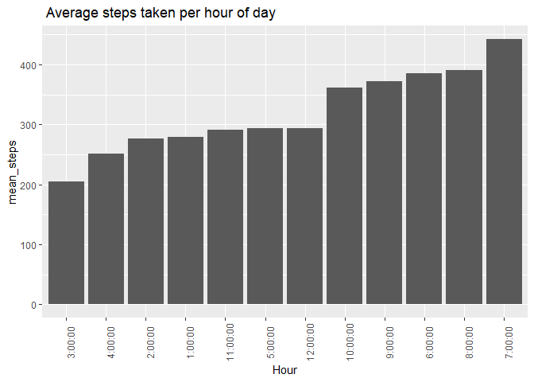
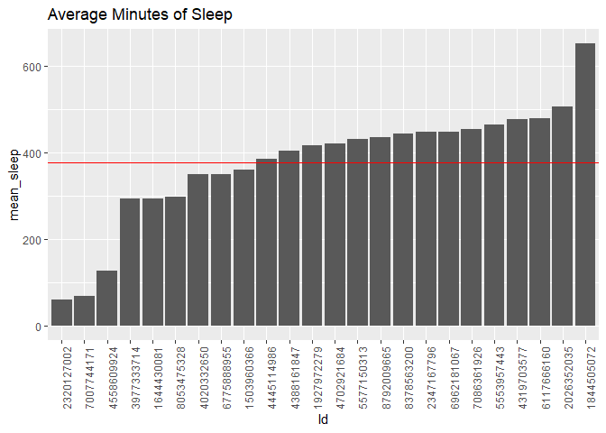
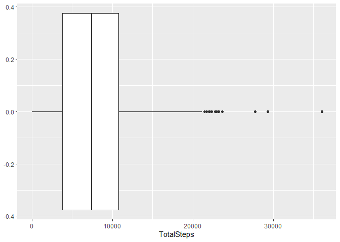
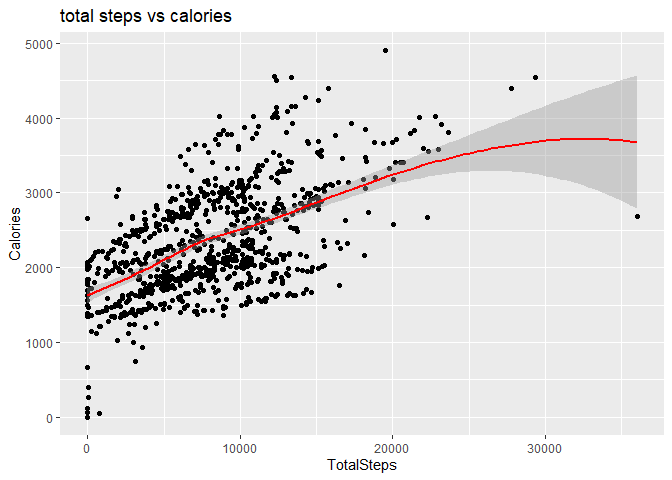

bellabeat casestudy
================

# summary

Bellatbeat, a high-tech company that manufactres health-focused smart
products for women. Bellabeat is a successful small company, but they
have the potential to become a larger player in the global smart device
market Urška Sršen, cofounder and Chief Creative Officer of Bellabeat,
believes that analyzing smart device fitness data could help unlock new
growth opportunities for the company.

# 1.Ask

- what are some trends in smart device usage?

- How could these trends apply to Bellabeat customers?

- How could these trends help influence Bellabeat marketing strategy?

**Stakeholders**

- Urška Sršen - Bellabeat cofounder and Chief Creative Officer

- Sando Mur - Bellabeat cofounder and key member of Bellabeat executive
  team

- Bellabeat Marketing Analytics team

# 2. Prepare

**about data**

- The data set is from Fitbit Fitness Tracker Data. The data contains
  personal fitness tracker from thirty fitbit users, including output
  for physical activity, heart rate, and sleep monitoring. It inlcudes
  information about daily activity, steps, and herat rate that can be
  used to explore user’s habits.

# 3. Process

- considering accessibility, amount of data and various visualization, I
  will use R to analyze the data

- Installing Packages and Opening Libraries

``` r
library(tidyverse)
library(skimr)
library(janitor)
library(dplyr)
library(lubridate)
```

importing Dataset daily activity, daily calories, hourly steps, daily
intensities, daily sleep and weight info

``` r
activity <- read_csv("Fitabase Data 4.12.16-5.12.16/dailyActivity_merged.csv")
Calories <- read.csv("Fitabase Data 4.12.16-5.12.16/dailyCalories_merged.csv")
hourly_steps <- read.csv("Fitabase Data 4.12.16-5.12.16/hourlySteps_merged.csv")
intensities <- read.csv("Fitabase Data 4.12.16-5.12.16/dailyintensities_merged.csv")
sleep <- read.csv("Fitabase Data 4.12.16-5.12.16/sleepDay_merged.csv")
weight <- read.csv("Fitabase Data 4.12.16-5.12.16/weightLogInfo_merged.csv")
```

checking sample size by participants ID

``` r
n_distinct(activity$Id)
n_distinct(Calories$Id)
n_distinct(sleep$Id)
n_distinct(weight$Id)
n_distinct(hourly_steps$Id)
```

33

33

24

8

33

because the sample size of Weight data is too small for minimum of 30,
I’ll exclude the dataset for later analyze. For the sleep data, i will
still keep the dataset but low validity compare to other datasets.

checking data columns

``` r
colnames(activity)
colnames(intensities)
colnames(sleep)
colnames(hourly_steps)
```

Changing Date format and dropping redundant columns

``` r
hourly_steps <- hourly_steps %>%  separate(ActivityHour, c("Date", "Hour"), sep = ' ')
activity <- subset(activity, select= -c(SedentaryActiveDistance, LoggedActivitiesDistance))
```

let’s have statistic summary tables

``` r
#summarizing data
#Activity
activity %>%  select(TotalSteps, TotalDistance, VeryActiveMinutes, FairlyActiveMinutes, LightlyActiveMinutes, SedentaryMinutes, Calories, ActivityDate) %>% drop_na() %>% summary()
```

    ##    TotalSteps    TotalDistance    VeryActiveMinutes FairlyActiveMinutes
    ##  Min.   :    0   Min.   : 0.000   Min.   :  0.00    Min.   :  0.00     
    ##  1st Qu.: 3790   1st Qu.: 2.620   1st Qu.:  0.00    1st Qu.:  0.00     
    ##  Median : 7406   Median : 5.245   Median :  4.00    Median :  6.00     
    ##  Mean   : 7638   Mean   : 5.490   Mean   : 21.16    Mean   : 13.56     
    ##  3rd Qu.:10727   3rd Qu.: 7.713   3rd Qu.: 32.00    3rd Qu.: 19.00     
    ##  Max.   :36019   Max.   :28.030   Max.   :210.00    Max.   :143.00     
    ##  LightlyActiveMinutes SedentaryMinutes    Calories    ActivityDate      
    ##  Min.   :  0.0        Min.   :   0.0   Min.   :   0   Length:940        
    ##  1st Qu.:127.0        1st Qu.: 729.8   1st Qu.:1828   Class :character  
    ##  Median :199.0        Median :1057.5   Median :2134   Mode  :character  
    ##  Mean   :192.8        Mean   : 991.2   Mean   :2304                     
    ##  3rd Qu.:264.0        3rd Qu.:1229.5   3rd Qu.:2793                     
    ##  Max.   :518.0        Max.   :1440.0   Max.   :4900

``` r
#Calories
Calories %>%  select(Calories) %>% drop_na() %>% summary()
```

    ##     Calories   
    ##  Min.   :   0  
    ##  1st Qu.:1828  
    ##  Median :2134  
    ##  Mean   :2304  
    ##  3rd Qu.:2793  
    ##  Max.   :4900

``` r
#Sleep
sleep %>% select(TotalSleepRecords, TotalMinutesAsleep, TotalTimeInBed) %>% drop_na() %>% summary()
```

    ##  TotalSleepRecords TotalMinutesAsleep TotalTimeInBed 
    ##  Min.   :1.000     Min.   : 58.0      Min.   : 61.0  
    ##  1st Qu.:1.000     1st Qu.:361.0      1st Qu.:403.0  
    ##  Median :1.000     Median :433.0      Median :463.0  
    ##  Mean   :1.119     Mean   :419.5      Mean   :458.6  
    ##  3rd Qu.:1.000     3rd Qu.:490.0      3rd Qu.:526.0  
    ##  Max.   :3.000     Max.   :796.0      Max.   :961.0

Create some new data frames before get in to Analyze

``` r
#on average, during which hour of the day were the most steps taken? 
hourly_steps %>% group_by(Hour) %>% summarize(mean_steps = mean(StepTotal)) %>% select(Hour, mean_steps) %>% arrange(desc(mean_steps)) %>%  head(5)
```

    ## # A tibble: 5 × 2
    ##   Hour     mean_steps
    ##   <chr>         <dbl>
    ## 1 7:00:00        443.
    ## 2 8:00:00        391.
    ## 3 6:00:00        386.
    ## 4 9:00:00        372.
    ## 5 10:00:00       361.

``` r
mean_steps <- hourly_steps %>% group_by(Hour) %>% summarize(mean_steps = mean(StepTotal)) %>% select(Hour, mean_steps) %>% arrange(desc(mean_steps)) %>% as.data.frame
head(mean_steps)
```

    ##       Hour mean_steps
    ## 1  7:00:00   442.8329
    ## 2  8:00:00   391.2259
    ## 3  6:00:00   385.9766
    ## 4  9:00:00   371.6062
    ## 5 10:00:00   361.4883
    ## 6 12:00:00   293.7780

``` r
#average amount of sleep for each participant 
mean_sleep <- sleep %>% group_by(Id) %>%  summarize(mean_sleep = mean(TotalMinutesAsleep)) %>% select(Id, mean_sleep)
head(mean_sleep)
```

    ## # A tibble: 6 × 2
    ##           Id mean_sleep
    ##        <dbl>      <dbl>
    ## 1 1503960366       360.
    ## 2 1644430081       294 
    ## 3 1844505072       652 
    ## 4 1927972279       417 
    ## 5 2026352035       506.
    ## 6 2320127002        61

# 4. Analyze & Visualize

**Findings from the summary**

- Daily average sedentary time is 991 minutes (16.5hour).

- Daily average steps taken: 7638.

- In average, participants spends 458 minutes(7.6hours) time in bed and
  419minute(7hour) for actual sleep.

- Most of the participants are lightly active

What time in a day participants are most active?

``` r
#average steps per hour 
ggplot(mean_steps, aes(x= Hour, y= mean_steps)) + 
  geom_col(aes(reorder(Hour, +mean_steps), mean_steps))+
  theme(axis.text.x = element_text(angle=90))+  
  labs(title = " Average steps taken per hour of day ")
```

<!-- -->

The graph shows that on average, participants are active between
6:00~9:00pm

``` r
#aeverage munutes of sleep 
ggplot(mean_sleep, aes(x = Id, y = mean_sleep)) + 
geom_col(aes(reorder(Id, + mean_sleep), y = mean_sleep)) + 
labs(title = "Average Minutes of Sleep") + 
theme(axis.text.x =  element_text(angle = 90)) +
geom_hline(yintercept = mean(mean_sleep$mean_sleep), color = "red")
```

<!-- -->

box plot for average steps per day

``` r
ggplot(data=activity, aes(x = TotalSteps)) + geom_boxplot()
```

<!-- -->

``` r
activity %>% select(TotalSteps) %>% summary()
```

    ##    TotalSteps   
    ##  Min.   :    0  
    ##  1st Qu.: 3790  
    ##  Median : 7406  
    ##  Mean   : 7638  
    ##  3rd Qu.:10727  
    ##  Max.   :36019

Daily average steps is 7638 and in range of 4000 to 11000 steps per day

Let’s find out correlation between steps and calories

``` r
ggplot(data=activity, aes(x=TotalSteps, y=Calories)) + geom_point()+ geom_smooth(color = "red") + labs(title = "total steps vs calories")
```

    ## `geom_smooth()` using method = 'loess' and formula = 'y ~ x'

<!-- -->

``` r
correlation <- activity %>% select(TotalSteps, Calories) %>% drop_na() %>% summarize(correlation = cor(TotalSteps, Calories)) 
print(correlation)
```

    ## # A tibble: 1 × 1
    ##   correlation
    ##         <dbl>
    ## 1       0.592

The result shows that correlation value for Total steps and Calories is
0.592 which is strong correlation

# 5. Conclusion

1.  we found that majority of the participants spent their day in
    sedentary and mostly active after 7:00pm. Bellabeat should focus
    their main customer to a women, full time working, especially those
    who work sedentary.

2.  Bellabeat could provide periodic reminders for those who sits for
    prolonged periods to stand up, stretch, and engage in light
    exercises. It could also offer guidance on effective workouts.

3.  Current medical guidelines suggest that most adults should aim for
    about 10,000 steps perday. since participants walks about 7500steps
    daily on average, bellabeat should encourage users to be more active
    than usual.
